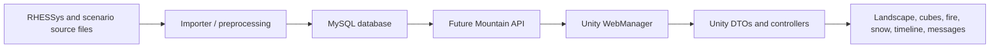

# Data Model

Last updated: 2026-06-12

## Purpose

This spec defines the current Future Mountain data model from the Unity/runtime point of view and outlines how the model should evolve for the Central Coast scenario while preserving Big Creek compatibility. For how these fields drive the 3D scene over time, see [DataMappings.md](DataMappings.md).

This first draft is based on the Unity repo, `ScenarioConfig_BigCreek.json`, runtime DTO classes, and API call sites. It is not yet an authoritative database schema spec. To complete it, we need a MySQL schema export and, ideally, the importer repo or importer output examples.

## Goals

- Document the Big Creek data contract as it exists today.
- Identify which fields drive visual behavior in Unity.
- Support an expanded Central Coast data model without breaking Big Creek.
- Establish a compatibility protocol for adding fields, tables, endpoints, and derived values.
- Keep importer, MySQL schema, API DTOs, and Unity DTOs aligned.

## Current Data Flow



The Unity project currently consumes API JSON for web builds and also retains older TextAsset/Resources parsing paths. The API and TextAsset paths do not fully share one centralized schema definition.

## Current Tables / API Resources

`ScenarioConfig_BigCreek.json` lists these output tables:

- `cubedata`
- `patchdata`
- `terraindata`
- `firedata`
- `waterdata`
- `dates`

`WebManager` currently calls these API resources:

- `cubedata/{patchIdx}/{warmingIdx}`
- `waterdata/{index}`
- `waterdata/total`
- `firedata/{warmingIdx}`
- `patchdata`
- `patchdata/{patchId}`
- `dates`
- `dates/{year}/{month}/{day}`
- `terraindata/{warmingIdx}`

## Runtime Entities

### Scenario

Current scenario config exists as `ScenarioConfig_BigCreek.json`, but Unity does not appear to load it directly at runtime.

Current Big Creek scenario properties:

- Scenario id/name: `BigCreek`
- Warming levels: `0 C`, `1 C`, `2 C`, `4 C`, `6 C`
- Fire enabled: true
- Vegetation layers: 2
- Database name: `bigcreek_rhessys`

Future scenarios should make scenario identity and schema version first-class runtime data.

Recommended fields:

- `scenarioId`
- `displayName`
- `region`
- `description`
- `schemaVersion`
- `apiBaseUrl`
- `availableWarmingLevels`
- `dateRange`
- `features`
- `dataContractVersion`

### Dates

Unity DTO: `DateModel`

Fields:

- `id`
- `date`
- `year`
- `month`
- `day`

Unity uses `dates` to convert between calendar dates and `timeIdx`. Many simulation systems depend on stable date indexing, so backward compatibility requires Big Creek date ids to remain stable or a compatibility map to be provided.

### Cube Data

Unity DTO: `CubeData`

Fields:

- `id`
- `dateIdx`
- `warmingIdx`
- `patchIdx`
- `snow`
- `evap`
- `netpsn`
- `depthToGW`
- `vegAccessWater`
- `qout`
- `litter`
- `soil`
- `heightOver`
- `transOver`
- `heightUnder`
- `transUnder`
- `leafCOver`
- `stemCOver`
- `rootCOver`
- `leafCUnder`
- `stemCUnder`
- `rootCUnder`

Unity visual uses include:

- `snow`: cube snow surface and precipitation-to-groundwater effect.
- `depthToGW`: groundwater depth display/soil visualization.
- `vegAccessWater`: soil water access.
- `qout`: stream height/outflow.
- `litter`: litter/burned/ground state.
- `netpsn`: model/statistics display and ranges.
- `transOver`, `transUnder`: evapotranspiration particles/statistics.
- `leafC*`, `stemC*`, `rootC*`: vegetation growth, roots, and fire biomass removal.

### Water Data

Unity DTO: `WaterData`

Fields:

- `index`
- `year`
- `month`
- `day`
- `qBase`
- `qWarm1`
- `qWarm2`
- `qWarm4`
- `qWarm6`
- `precipitation`

Unity visual uses:

- Landscape river/streamflow.
- Timeline annual precipitation.
- Warming-specific streamflow comparison.

Current concern: the schema encodes warming levels as separate columns (`qBase`, `qWarm1`, etc.). Future scenarios may need a normalized form such as `(scenarioId, dateIdx, warmingIdx, q, precipitation)` so additional climate cases do not require new columns.

### Patch Data

Unity DTOs:

- `PatchDataRecord`
- `PatchPointCollection`
- `PatchPoint`
- `PatchDataList`

Fields include:

- `id`
- `patchID`
- `_data`
- `points`
- `location`
- `fireLocation`
- `alphamapLoc`
- `utm`

Patch data links model patches to Unity landscape coordinates, fire grid cells, terrain alphamap positions, and UTM/spatial position.

### Fire Data

Unity DTOs:

- `FireDataFrameJSONRecord`
- `TimelineFireData`
- Runtime nested fire classes in `LandscapeController`: `FireDataPoint`, `FireDataPointCollection`, `FireDataFrame`, `FireDataFrameRecord`

Fields include:

- `id`
- `warmingIdx`
- `year`
- `month`
- `day`
- `gridHeight`
- `gridWidth`
- `_dataList`

Important model distinction:

- Fire dates are scheduled scenario events.
- Fire spread/severity after ignition is data-driven.

For Big Creek, scheduled fire dates are currently hard-coded in Unity as July 15, 1969 and November 20, 1988. These should move into scenario data before Central Coast work.

### Terrain Data

Unity DTOs:

- `TerrainDataFrame`
- `TerrainDataFrameJSONRecord`
- `TimelineTerrainData`

Fields include:

- `id`
- `warmingIdx`
- `year`
- `month`
- `gridSize`
- `pixelGrainSize`
- `decimalPrecision`
- `_dataList`

Unity uses terrain data for precomputed/interpolated splatmaps, including snow and burned/unburned texture states.

For Central Coast v2, preserve this meaning. `TerrainData` should remain the
precomputed Unity/API-facing large-landscape frame, not a raw RHESSys CSV import
table. The Central Coast raw stratum carbon file is long-format source data:

```text
month + year + zoneID + patchID + stratumID -> totalc, total_plantc
```

It must be transformed after import into precomputed `TerrainData` frames using
the patch map (`zoneID` footprints), vegetation/carbon values, burn values, and
scenario metadata. Unity should consume the precomputed `TerrainData` shape
rather than millions of raw stratum rows.

### Timeline Water Data

Unity DTO:

- `TimelineWaterData`
- `PrecipByYear`

Fields:

- `year`
- `precipitation`

This is a lightweight yearly aggregate for timeline rendering.

## Current Schema Risks

- Warming levels are hard-coded as five indices and, in water data, as distinct columns.
- Fire dates are hard-coded in Unity instead of scenario data.
- Some payload fields store nested JSON strings (`_data`, `_dataList`) rather than normalized relational records.
- TextAsset parsing depends on positional column enums.
- Runtime DTOs, database schema, API JSON, and importer mappings are not generated from one source of truth.
- Big Creek-specific dates, terrain assumptions, cube count, and snow assumptions are scattered across code.

## Compatibility Protocol

### Version Every Contract

Add explicit versions:

- Scenario version.
- Database schema version.
- Importer version.
- API contract version.
- Unity-supported minimum/maximum contract version.

Unity should fail clearly if the API reports an incompatible contract.

### Add Fields Without Breaking Big Creek

Rules:

- New API fields must be optional for old scenarios.
- Big Creek responses should continue to include all current fields with the same names and meanings.
- Unity should ignore unknown fields.
- Unity should supply defaults for missing optional fields.
- Renames should be additive first: add the new field, keep the old field, migrate consumers, then deprecate later.

### Prefer Named, Normalized Scenario Data

For new scenario data, prefer structures like:

```text
scenarioId
dateIdx
warmingIdx or climateCaseId
patchIdx
variableName
value
unit
```

or table-specific normalized columns, rather than adding one column per warming level.

### Preserve Big Creek Adapter Behavior

If the Central Coast schema changes substantially, create an adapter layer:

- Big Creek adapter maps current tables/API fields to the canonical runtime model.
- Central Coast adapter maps the new schema to the same canonical runtime model.
- Unity controllers consume canonical runtime objects, not raw database-shaped DTOs.

## Recommended Canonical Runtime Model

The next refactor should introduce an internal scenario data model separate from API DTOs:

- `ScenarioDefinition`
- `ClimateCase`
- `DateRecord`
- `CubeTimeSeries`
- `LandscapePatchFrame`
- `WaterFrame`
- `FireEvent`
- `FireSpreadFrame`
- `TerrainSurfaceFrame`
- `VariableDefinition`

`VariableDefinition` should include:

- `id`
- `displayName`
- `unit`
- `sourceColumn`
- `defaultValue`
- `visualRole`
- `minMaxStrategy`
- `isRequired`

## Needed Inputs To Complete This Spec

A MySQL Workbench 8 export would be very helpful. Best export format:

- `CREATE TABLE` statements for all Future Mountain tables.
- Indexes, primary keys, foreign keys, and unique constraints.
- Column types, nullability, defaults, and comments if present.
- A small anonymized/sample row set for each table if possible.
- Stored procedures/views if the API depends on them.

Also helpful:

- API response examples for each endpoint listed above.
- Importer repo or importer README.
- Central Coast proposed column list, including units and whether each column should drive visuals/UI.
- Any existing API/backend models if the API is a separate .NET/Node/Python project.

## Open Questions

- Should future climate cases remain numeric warming degrees, or become named scenario cases?
- Are fire event dates part of RHESSys metadata, scenario curation, or importer config?
- Should patch spatial data remain JSON blobs or become normalized point rows?
- Should terrain/fire `_dataList` blobs remain for performance, or be generated/cache artifacts outside the canonical database?
- Does Big Creek need to run indefinitely on the old API, or can it be migrated behind an adapter?
