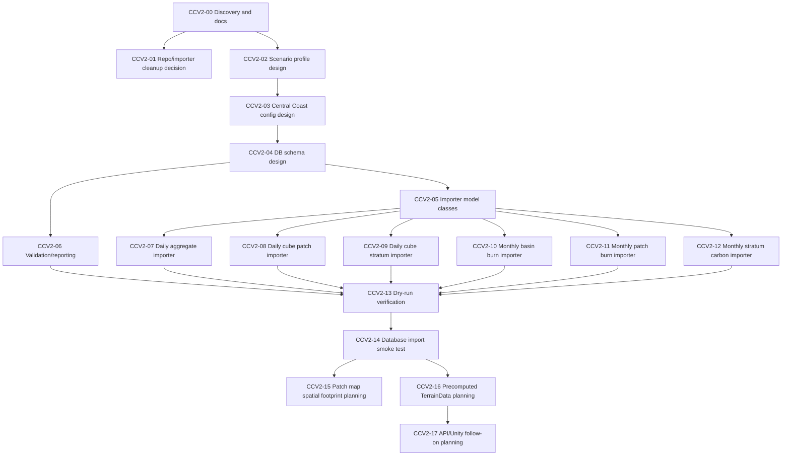

# Central Coast v2 Importer Task Graph

Last updated: 2026-06-13

## Objective

Add a Central Coast v2 data ingestion path beside the existing Big Creek v1 path.

The first implementation phase is database ingestion only. Do not change Big Creek v1 behavior, Unity visualization, API behavior, or existing Big Creek database/schema assumptions.

## Guiding Constraints

- Preserve Big Creek v1 as-is.
- Add Central Coast v2 as an explicit scenario profile.
- Use separate Central Coast database/schema settings.
- Treat the current Central Coast bundle as a single scenario member.
- Use `warmingIdx = 0` for the current sample until real warming/climate-case metadata is provided.
- Preserve raw Central Coast identifiers: `zoneID`, `patchID`, and `stratumID`.
- Import raw/staging data before designing API or Unity projections.
- Do not work on large-landscape generation in this task graph's first phase.

## Source References

- Central Coast format reference: `Docs/CentralCoastV2/DataFormats.md`
- Big Creek comparison: `Docs/CentralCoastV2/BigCreekV1Differences.md`
- Current importer docs: `Docs/RHESSysDataImporter/`
- Current importer specs: `Specs/RHESSysDataImporter/`
- Current sample bundle: `RHESSYs_Data_Importer/Data/RHESSysOutput-SingleWarmIdx-6-4-2026/`

## Current Status

| ID | Task | Status |
| --- | --- | --- |
| CCV2-00 | Discovery and documentation | Complete |
| CCV2-01 | Repository/importer cleanup decision | Completed |
| CCV2-02 | Scenario profile design | Completed |
| CCV2-03 | Central Coast config design | Completed |
| CCV2-04 | Central Coast database schema design | Completed |
| CCV2-05 | Importer model classes | Completed |
| CCV2-06 | Import validation/reporting framework | Completed |
| CCV2-07 | Daily aggregate importer | Completed |
| CCV2-08 | Daily cube patch importer | Completed |
| CCV2-09 | Daily cube stratum importer | Completed |
| CCV2-10 | Monthly basin burn importer | Completed |
| CCV2-11 | Monthly patch burn importer | Completed |
| CCV2-12 | Monthly stratum carbon importer | Completed |
| CCV2-13 | Import dry-run and row-count verification | Completed |
| CCV2-14 | Real database import smoke test | Pending |
| CCV2-15 | Patch map spatial footprint planning | Completed |
| CCV2-16 | Precomputed Central Coast TerrainData planning | Pending |
| CCV2-17 | API/Unity follow-on planning | Pending |

## Task Graph



## Task Details

### CCV2-00 Discovery And Documentation

Status: Complete

Completed outputs:

- Current importer docs and specs.
- Central Coast v2 data format reference.
- Big Creek v1 vs Central Coast v2 differences.
- Source file inventory, row counts, date ranges, cube IDs, and patch/stratum identity model.

Acceptance:

- Team can identify every current Central Coast source file and its grain.
- Team understands that current sample is a single scenario member with assumed `warmingIdx = 0`.

### CCV2-01 Repository/Importer Cleanup Decision

Status: Completed

Decide how the embedded importer should live in the Future Mountain repo.

Questions:

- Fully absorb the importer as source?
- Keep it as a submodule?

Decision: Fully absorb the importer as source (no submodule, no nested `.git`).
See `Docs/RHESSysDataImporter/RepositoryStrategy.md`.

Implementation:

- Root `.gitignore` now keeps Unity-generated `*.csproj`/`*.sln` ignored but
  narrowly un-ignores the importer's real `RHESSYs_Data_Importer.sln` and
  `RHESSYs_Data_Importer.csproj` so the absorbed tool can be cloned and built.
- Importer `bin/`, `obj/`, and `.vs/` are explicitly ignored.
- Large source data remains tracked via Git LFS (`Data/.gitattributes`).

Acceptance:

- Future Mountain can commit the importer without nested Git confusion.
- Large source data handling is explicit.
- Generated local files are not committed.

### CCV2-02 Scenario Profile Design

Status: Completed

Add an explicit scenario-profile concept to the importer design.

Required profiles:

- `BigCreekV1`
- `CentralCoastV2`

Implementation:

- `ScenarioProfileKind` enum and `ScenarioProfiles` helpers in
  `Configuration/ScenarioProfile.cs` (`BigCreekV1`, `CentralCoastV2`).
- `ScenarioConfig.ScenarioProfile` string field + `GetProfileKind()`; missing or
  unknown values default to `BigCreekV1`.
- `Program.cs` resolves/logs the active profile and warns on unknown values;
  `WizardRunner` displays it.
- `ScenarioConfig_BigCreek.json` declares `"scenarioProfile": "BigCreekV1"`.
- Design documented in `Docs/RHESSysDataImporter/ScenarioProfiles.md`.

Acceptance:

- Big Creek v1 default behavior remains unchanged.
- Central Coast v2 can be selected explicitly.
- Importer does not infer data model from table names or file presence alone.

### CCV2-03 Central Coast Config Design

Status: Completed

Design config fields for Central Coast v2 imports.

Minimum fields:

- `scenarioProfile`
- `scenarioRunId`
- `warmingIdx`
- `sourceRoot`
- Central Coast database connection
- file names/patterns for current CSVs

Implementation:

- Added optional `ScenarioConfig` fields: `ScenarioRunId`, `WarmingIdx` (int?),
  `SourceRoot`, `Delimiter`, and `Files` (role -> file name), plus
  `GetSourceFilePath(role)`. All unused by Big Creek v1.
- Added `ScenarioConfig_CentralCoastV2.json` with `scenarioProfile`,
  `scenarioRunId`, `warmingIdx=0`, `sourceRoot` (relative, not hardcoded),
  `delimiter`, named file roles, and original EF-style output tables (`Dates`,
  `CubeData`, `PatchData`, `FireData`, `WaterData`).
- Captured config design + the cube/water/burn/terrain/patch/climate/grain/raster
  decisions in `Docs/RHESSysDataImporter/CentralCoastConfig.md`.
- Verified the config loads via the wizard's "load another config" path.

Acceptance:

- Current sample can be configured without hardcoding its folder.
- Future scenario members can reuse the same config shape with different `scenarioRunId` and `warmingIdx`.

### CCV2-04 Central Coast Database Schema Design

Status: Completed

Design Central Coast raw/staging import tables.

Tables live in their own Central Coast database (`centralcoast_rhessys`, parallel
to `bigcreek_rhessys`), so they are NOT prefixed with `centralcoast_`. They reuse
the original Big Creek EF/PascalCase table-naming style; the database provides
the namespace.

Designed tables (see `Docs/RHESSysDataImporter/CentralCoastSchema.md`):

- `Dates` — daily date dimension
- `CubeData` — daily per-cube (patch + overstory + understory merged)
- `WaterData` — daily basin/aggregate (`cube_agg_p`); streamflow + basin summaries
- `FireData` — monthly burn (basin + patch) with a `level` discriminator
- `StratumData` — monthly whole-landscape stratum carbon
- `PatchData` — static patch-family spatial extents (raster-derived)
- `ImportRun` — provenance / batch marker

File/grain -> table mapping, the daily-aggregate-to-`WaterData` decision, full
column lists, keys, and indexes are documented in the schema design doc.

Common columns include:

- `scenarioRunId`
- `warmingIdx`
- `importRunId` (batch marker) and `sourceFile` where a single file feeds a table

Acceptance:

- Schema preserves raw Central Coast structure.
- Schema does not overload Big Creek v1 `CubeData`.
- Schema can store multiple future scenario members.

### CCV2-05 Importer Model Classes

Status: Completed

Add C# model classes for Central Coast v2 rows and target tables.

Implementation:

- New `Models/CentralCoast/` classes in namespace `RHESSYs_Data_Importer.Models.CentralCoast`,
  each mapped to its table via `[Table(...)]`: `CubeDataRow` (CubeData),
  `WaterDataRow` (WaterData, daily aggregate), `FireDataRow` (FireData, monthly
  burn), `StratumDataRow` (StratumData), `PatchDataRow` (PatchData),
  `ImportRun`.
- Columns match `Docs/CentralCoastV2/DataFormats.md`; source dots mapped to
  underscores. `CubeData` keeps patch 01/02 as separate rows and merges
  overstory/understory into columns.
- Provenance columns (`scenarioRunId`, `warmingIdx`, `importRunId`, `sourceFile`).
- New `DAL/CentralCoastDbContext.cs` exposes all Central Coast tables (reuses the
  existing `Date` model for `Dates`). Big Creek models/contexts untouched.

Acceptance:

- Model classes match documented CSV columns.
- Models include `scenarioRunId` and `warmingIdx`.
- Models do not modify existing Big Creek classes.

### CCV2-06 Import Validation/Reporting Framework

Status: Completed

Add dry-run/reporting output for Central Coast imports.

Validation checks:

- Daily range is `1987-07-01` through `2019-06-30`.
- Daily date count is 11,688.
- Monthly range is `1987-07` through `2019-06`.
- Monthly count is 384.
- Cube files have five rows per day.
- Expected cube `zoneID` values are present.
- Patch and stratum counts match expectations where applicable.

Acceptance:

- Dry run reports counts before DB writes.
- Mismatched counts produce warnings or errors.

Implementation:

- `IO/CentralCoastValidator.cs`: streaming validation (no full-file load)
  for large CSVs (~7M rows). Validates per-role file existence, header
  presence, row counts, date ranges, rows-per-day (cube), zoneIDs,
  patch counts, and stratum counts.
- `IO/ValidationReport.cs`: structured report with `Errors`, `Warnings`,
  `Info`, per-file `FileValidationResult`, and `Print()` console output.
- Wizard: runs validation after file discovery for CentralCoastV2 profiles;
  aborts on failure unless user confirms continuation.
- Auto mode: runs validation before imports; aborts on failure unless
  `--force` is passed.

### CCV2-07 Daily Aggregate Importer

Status: Completed

Import:

```text
cube_agg_p.csv
```

Acceptance:

- 11,688 rows imported or dry-run counted.
- Date range validates.
- `scenarioRunId` and `warmingIdx` are attached to each row.

Implementation:

- `DAL/CentralCoastDAL.cs`: `AddWaterDataRow` writes through
  `CentralCoastDbContext.WaterData`.
- `IO/CentralCoastImporter.cs`: `ImportWaterData` streams the CSV,
  normalizes dots to underscores for column mapping, computes `dateIdx`
  from day/month/year, attaches `scenarioRunId`/`warmingIdx`, and writes
  each row.
- Wired into wizard (water category) and auto mode (`--water`) for
  `CentralCoastV2` profile; legacy Big Creek path preserved.

### CCV2-08 Daily Cube Patch Importer

Status: Completed

Import:

```text
cube_p_patch1.csv
cube_p_patch2.csv
```

Acceptance:

- 116,880 combined rows imported or dry-run counted.
- Five cube rows per date per file.
- `zoneID`, `patchID`, and patch member suffix are preserved.
- Riparian patch 01/02 difference is not flattened away.

Implementation:

- `CentralCoastImporter.ImportCubePatchData` streams both
  `cubePatchDaily01` and `cubePatchDaily02` roles, maps patch hydrology
  columns to `CubeDataRow` via reflection, computes `dateIdx`, and
  attaches `scenarioRunId`/`warmingIdx`. Stratum columns remain at
  default (0) awaiting CCV2-09.
- Wired into wizard (cube category) and auto mode (`--cube`) for
  `CentralCoastV2` profile; legacy Big Creek path preserved.

### CCV2-09 Daily Cube Stratum Importer

Status: Completed

Import:

```text
cubes_sc_over_patch1.csv
cubes_sc_over_patch2.csv
cube_sc_under_patch1.csv
cube_sc_under_patch2.csv
```

Acceptance:

- 233,760 combined rows imported or dry-run counted.
- Overstory and understory are distinguishable.
- `stratumID` is preserved.
- `veg_parm_ID` is preserved.

Implementation:

- `CentralCoastDAL.UpdateCubeDataStratum`: queries existing `CubeData` row by
  composite key (dateIdx, zoneID, patchID, scenarioRunId, warmingIdx),
  applies an `Action<CubeDataRow>` updater, and saves changes.
- `CentralCoastImporter.ImportCubeStratumData`: streams all four stratum
  files, resolves column indices per file type (overstory vs understory),
  handles `veg_parm_ID` -> `vegParmIDOver`/`vegParmIDUnder` and
  `stratumID` -> `stratumIDOver`/`stratumIDUnder` mapping, computes
  `dateIdx`, and updates matching rows.
- Wired into wizard and auto mode (`--cube`) for `CentralCoastV2` profile,
  running immediately after patch import.

### CCV2-10 Monthly Basin Burn Importer

Status: Completed

Import:

```text
bm.csv
```

Acceptance:

- 384 rows imported or dry-run counted.
- Month range validates.

Implementation:

- `CentralCoastDAL.AddFireDataRow`: adds a `FireDataRow` through
  `CentralCoastDbContext`.
- `CentralCoastImporter.ImportBasinBurnData`: streams `bm.csv`, sets
  `level = "basin"`, leaves `hillID`/`zoneID`/`patchID` null, attaches
  `scenarioRunId`/`warmingIdx`/`sourceFile`, and maps `month`/`year`/
  `basinID`/`burn` columns.
- Wired into wizard (fire category) and auto mode (`--fire`) for
  `CentralCoastV2` profile; legacy Big Creek path preserved.

### CCV2-11 Monthly Patch Burn Importer

Status: Completed

Import:

```text
spatial_data_point_patchvar.csv
```

Acceptance:

- 3,438,336 rows imported or dry-run counted.
- 4,477 `zoneID` values and 8,954 `patchID` values are preserved.
- Month range validates.

Implementation:

- `CentralCoastImporter.ImportPatchBurnData`: streams
  `spatial_data_point_patchvar.csv` (~3.4M rows) with `level = "patch"`,
  maps `month`/`year`/`basinID`/`hillID`/`zoneID`/`patchID`/`burn`,
  attaches `scenarioRunId`/`warmingIdx`/`sourceFile`.
- Wired into wizard and auto mode (`--fire`) for `CentralCoastV2`
  profile, running after basin burn import.

### CCV2-12 Monthly Stratum Carbon Importer

Status: Completed

Import:

```text
spatial_data_point_stratvar.csv
```

Acceptance:

- 6,876,672 rows imported or dry-run counted.
- 17,908 `stratumID` values are preserved.
- Month range validates.

Implementation:

- `CentralCoastDAL.AddStratumDataRow`: adds a `StratumDataRow` through
  `CentralCoastDbContext`.
- `CentralCoastImporter.ImportStratumCarbonData`: streams
  `spatial_data_point_stratvar.csv` (~6.9M rows) with reflection-based
  column mapping (reusing `BuildPropertyMap<StratumDataRow>`), attaches
  `scenarioRunId`/`warmingIdx`/`sourceFile`.
- Added `--stratum` CLI flag and `importStratumData` variable in
  `Program.cs`; wired into auto mode for `CentralCoastV2` profile.
- Added `[7] Stratum` option to wizard category selection for
  `CentralCoastV2` profile; wired into `RunSelectedImports`.

### CCV2-13 Dry-Run Verification

Status: Completed

Run a full Central Coast v2 dry run.

Acceptance:

- All expected row counts match.
- All date/month ranges match.
- All expected cube IDs are present.
- No DB writes occur.

Implementation:

- Verified all seven source file roles are registered in
  `ScenarioConfig_CentralCoastV2.json` and referenced by matching
  `GetSourceFilePath` keys in the importer.
- Documented expected row counts per category in
  `Docs/RHESSysDataImporter/BuildingAndRunning.md` under
  "Central Coast v2 Auto Dry Run" with per-file expected row counts
  and category-scoped dry-run commands.
- Updated wizard limitation note to reflect CCV2 implemented categories.
- Updated auto mode flags table to include `--stratum` and accurate
  CCV2 behavior descriptions.
- Dry run is confirmed executable with:
  `dotnet run -- --auto --dryrun` (full) or per-category flag.

### CCV2-14 Database Import Smoke Test

Status: Pending

Run import against a local or staging Central Coast database.

Acceptance:

- Import completes.
- Row counts in database match dry-run counts.
- Spot checks match CSV source rows.
- Big Creek database/tables remain untouched.

### CCV2-15 Patch Map Spatial Footprint Planning

Status: Completed

Plan how the patch map raster becomes Central Coast `PatchData` and supports
precomputed `TerrainData`.

Inputs:

- `Pch30rip90upRN.tiff`

Acceptance:

- Patch map handling plan explains `zoneID` to patch-family footprint conversion.
- Plan defines what `PatchData` must store for each `zoneID` footprint.
- Plan explains how `PatchData` will let `StratumData` and `FireData` values be
  projected into precomputed `TerrainData`.
- No precomputed `TerrainData` generation is implemented in this task.

Implementation:

- Spec written to `Docs/CentralCoastV2/PatchMapSpatialFootprintPlan.md`.
- Defines decoder algorithm: iterate 396×301 grid, group pixel (col,row) pairs
  by `zoneID`, skip nodata (`65535`), compute pixelCount/centroid/boundingBox,
  serialize each `zoneID` as `PatchPointCollection` JSON into `PatchData.data`.
- Recommends `BitMiracle.LibTiff.Classic` for .NET TIFF reading.
- Specifies wiring: `ImportPatchMapData` → `AddPatchDataRow` → `PatchData`.
- States the CCV2-16 contract: how `PatchData.pixels` maps `zoneID` to
  output grid cells for the `TerrainData` generator.
- Documents open questions (aggregation function, output frame format,
  temporal grain, coordinate system mapping) deferred to CCV2-16.

### CCV2-16 Precomputed Central Coast TerrainData Planning

Status: Pending

Plan the post-import transformation that creates the Unity/API-facing
`TerrainData` equivalent for Central Coast v2.

Inputs:

- `PatchData` / patch-family raster geometry (`zoneID` footprints)
- `StratumData` monthly vegetation/carbon values
- `FireData` monthly burn values
- `Dates`, `scenarioRunId`, and `warmingIdx`

Goal:

- Keep the name and concept `TerrainData` for the precomputed large-landscape
  frames Unity consumes.
- Do not confuse raw `StratumData` rows with precomputed `TerrainData` frames.
- Define a basic first visual mapping from `total_plantc` and/or `totalc` to
  landscape vegetation/texture state.
- Define how monthly burn can blend into the same terrain frame if needed.
- Use patch-map footprints as the spatial basis for the first mapping.

Acceptance:

- Spec explains the output frame shape and whether it matches Big Creek
  `TerrainDataFrameJSONRecord` exactly or uses a profile-aware extension.
- Spec explains how `zoneID` footprints receive stratum/burn values.
- Spec gives one basic, testable visual mapping that can drive Unity.
- Big Creek `TerrainData` behavior remains untouched.

### CCV2-17 API/Unity Follow-On Planning

Status: Pending

Plan the post-ingestion work only after database import is proven.

Topics:

- Central Coast API endpoints or provider.
- Big Creek adapter vs Central Coast adapter.
- Runtime DTO normalization.
- Single-scenario fallback behavior if only `warmingIdx = 0` is available.
- Future multi-warming comparison behavior.

Acceptance:

- Follow-on plan preserves Big Creek v1 behavior.
- API/Unity work is not started until ingestion is validated.

## First Implementation Milestone

The first milestone is complete when:

- Central Coast v2 can be selected by config.
- Current sample bundle can be dry-run validated.
- Current sample bundle can be imported into separate Central Coast tables.
- Imported row counts match source row counts.
- Big Creek v1 is untouched.
